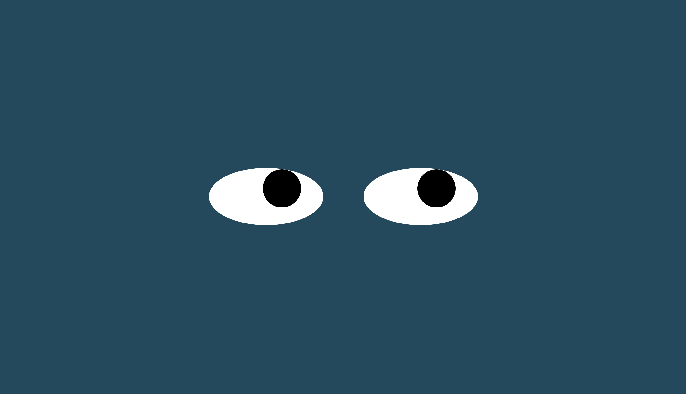

# Eye-Exercise

The Eye-Exercise was created for MITxPro full-stack web development program.  

<a href="https://foreverphoenix21.github.io/Eye-Exercise/">
   </a
>

## Description:

 The Eye-Exercise is a project with two eyes that follows your mouse movment. Created in JavaScript and CSS, this webpage is a dynamic experience.

## Installation:

 Upload the HTML file to your browser or fork and clone the project saving the files to your local hard drive. 
 

You can also run the program by clicking on the above picture in this readme file.

## Usage:

 This exercise was made to demonstrate what is possible by manipulating styles combining HTML, CSS, and JavaScript.

## Roadmap:

*
 This exercise will continually be built and improved on as I learn additional skills in Javascript. 
*

***

**
 Future updates: 
**
- Upage the CSS and add more design to the eyes.
- Create additional set of eyes and shapes with a mouse moving element.  
- Create a mouse trail element. Have the eyes folow the mouse trail.

## Support:

 Want to share feedback or comments?

 
  
  Reach me on *[Linkedin](https://www.linkedin.com/in/derek-diaz/)* or *[Twitter](https://twitter.com/diazcsu).*
  

